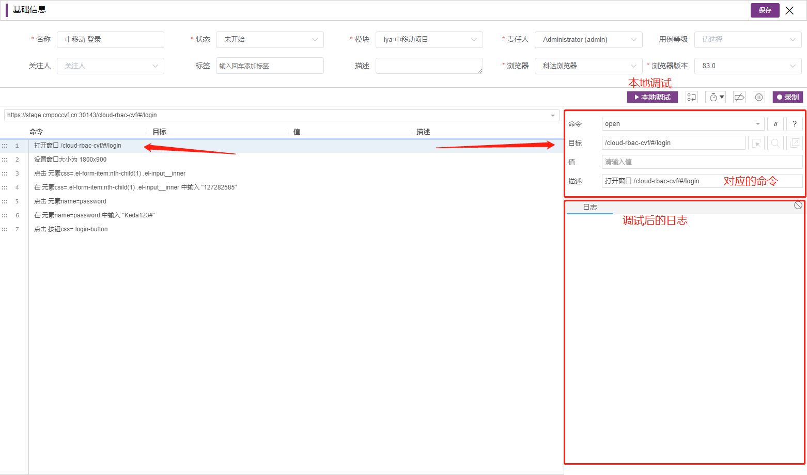

# 模块介绍

## 介绍

UI 自动化测试模块是由行业应用开发部-研发四部开发团队独立打造的、基于 selenium ide 的深度定制优化的 UI 自动化测试平台。UI 自动化测试通过提供独有的插件，插件直接运行在浏览器中，通过记录真正的用户操作的 dom 结构，来完成 UI 自动化场景用例的自动化编写，以及操作回放。方便快捷的实现 UI 自动化场景的编写、复用等操作。

<a  class="action-button" href="/uiApi/">
快速上手 →
</a>

## 优势

- 低成本：低学习成本，由传统的测试人员需要学习 python 等多种开发语言，变为仅需熟悉 UI 指令。
- 高效率：由传统的编程，变为直接录制，减少用户手动编写的工作量。
- 易读性：将用户的操作转译为较友好的自然语言，使得测试用例更易读。
- 智能定位：系统提供了多种定位方式，同时加入了智能索引功能，系统可通过关键字进行匹配。
- 本地调制：提供了完善的本地调试功能，录制好的场景可即时调试。
- 定时执行：设置定时任务后，用户不开浏览器也能自动运行测试场景。

## 核心界面

