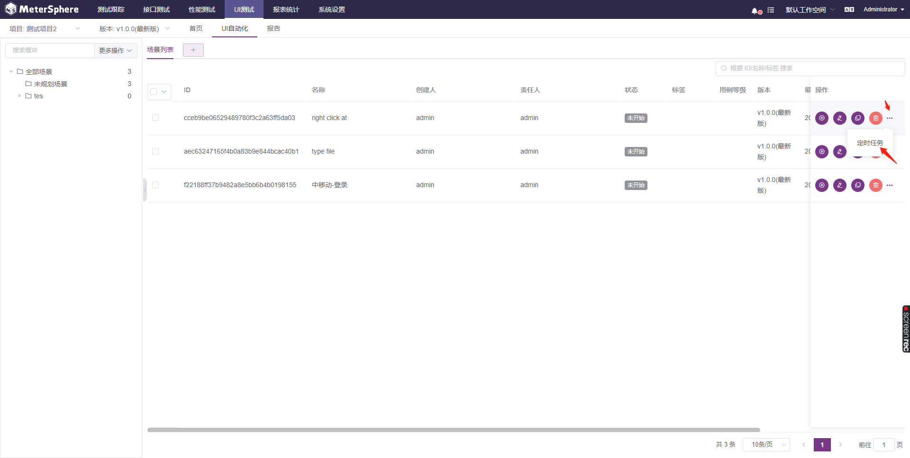

# 快速上手

### 第一步：安装插件

#### 1、浏览器访问 chrome://extensions/，如下图

#### 2、勾选开发者模式后，将插件文件拖拽到该页面，如下图

#### 3、点击“添加扩展程序”，如下图

#### 4、打开无痕模式，如下图

### 第二步：创建项目

在统一测试平台中，测试用例、测试计划、接口测试、UI 测试及性能测试等的管理均通过项目进行分权分域查看和管理，使用统一测试平台进行测试，登录进入工作空间后，首先需要创建项目，在项目下创建管理操作功能用例、测试计划、接口测试、UI 测试、性能测试等。

- 在左侧菜单中点击【系统设置】，在打开的页面左侧二级菜单中，选择【工作空间】下【项目管理】菜单，打开【项目管理】页面。

- 在【项目管理】页面，点击【创建项目】 按钮，打开【创建项目】对话框，在对话框中输入项目的基本信息后，点击【确定】按钮创建一个新项目。

### 第三步：创建 UI 自动化测试

统一测试平台 Web UI 测试提供了首页、UI 自动化、测试报告等 Web UI 测试相关功能。 用户可以使用多级模块来组织管理项目下的 UI 自动化场景，执行场景，生成查看测试报告。

- 创建模块

  

- 创建 UI 自动化场景

  

- 导入 UI 自动化场景

  

  

- 本地调试 UI 自动化场景

  

- 设置定时任务

  

  

- 生成测试报告

  

  
